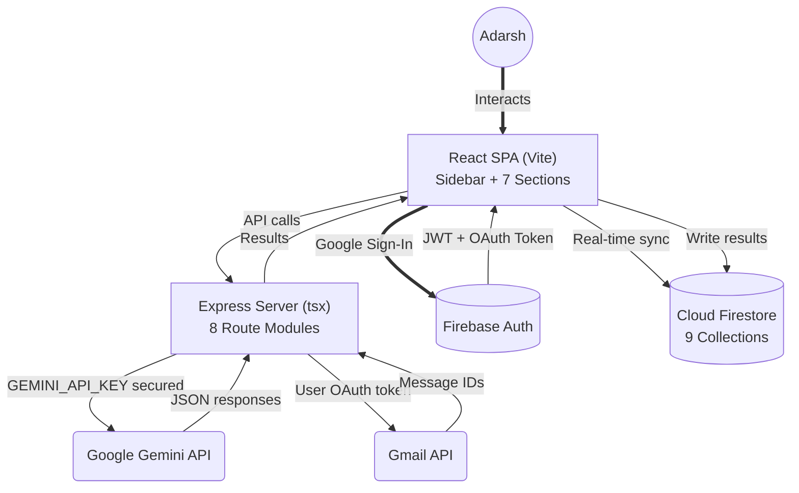
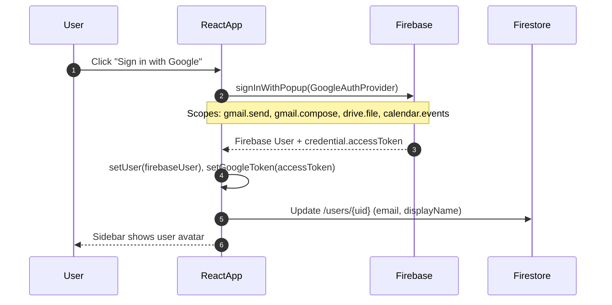
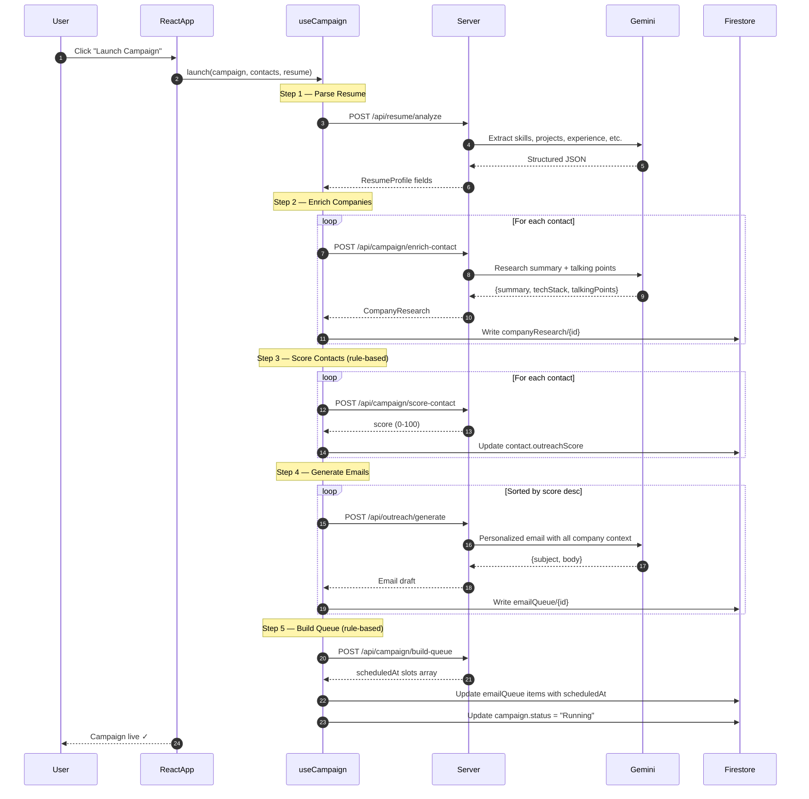
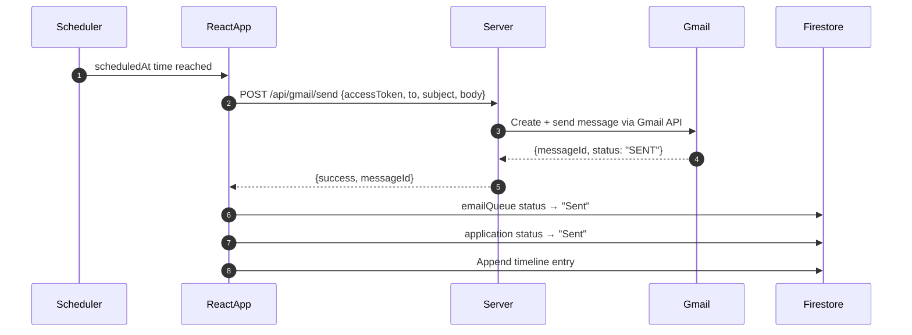
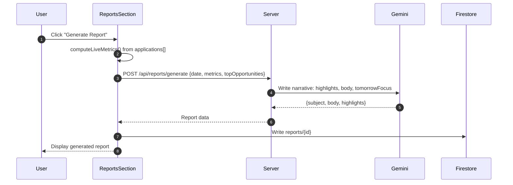

# Project Architecture — V3

## 1. Overview

Outreach Agent V3 is a **Full Stack (Vite + React client + Node/Express server)** application with the following design principles:

1. **Gemini API key** is server-side only — never in the client bundle
2. **Google OAuth token** is React state only — never persisted to disk or Firestore
3. **Firestore security rules** enforce per-user data isolation via `request.auth.uid`
4. **AI used minimally** — only for resume parsing, enrichment, email generation, reply classification, and daily reports; all scheduling and scoring is rule-based

---

## 2. Component Diagram



---

## 3. Frontend Component Tree

```
App.tsx
└── Sidebar.tsx                  ← Dark collapsible sidebar, badges
    ├── Dashboard (activeSection)
    │   └── DashboardSection.tsx ← 6 stat cards, campaign bars, activity feed
    ├── Resume
    │   └── ResumeSection.tsx    ← PDF/DOCX upload + Gemini analysis
    ├── Contacts
    │   └── ContactsV2Section.tsx ← 20-field CSV import, score rings, enrichment
    ├── Campaigns
    │   └── CampaignsSection.tsx  ← Builder + 5-step launch progress
    ├── Pipeline
    │   └── PipelineSection.tsx   ← Kanban (9 stages) + list view
    ├── Reports
    │   └── ReportsSection.tsx    ← Live snapshot + AI report + history
    └── Settings
        └── SettingsSection.tsx   ← Gmail, limits, scheduler, FU timeline
```

**Supporting hooks:**
- `useAuth.ts` — Firebase auth + Gmail OAuth scopes
- `useFirestoreSync.ts` — 8-collection live subscriptions + CRUD handlers
- `useCampaign.ts` — 5-step campaign launch orchestrator

---

## 4. Backend Route Structure

```
server/index.ts
├── GET  /api/health
├── POST /api/resume/analyze
├── POST /api/resume/parse-document
├── POST /api/campaign/create
├── POST /api/campaign/score-contact       ← rule-based, no AI
├── POST /api/campaign/enrich-contact      ← Gemini
├── POST /api/campaign/build-queue         ← rule-based, no AI
├── POST /api/outreach/generate            ← Gemini
├── POST /api/reports/generate             ← Gemini
├── POST /api/reports/classify-reply       ← Gemini
├── POST /api/gmail/send
├── POST /api/scrape/url
└── POST /api/job/match                    ← legacy
```

---

## 5. Sequence Diagrams

### A. Google Sign-In


### B. Campaign Launch (5 Steps)


### C. Email Send Flow


### D. Daily Report


---

## 6. Design Decisions

| Decision | Rationale |
|---|---|
| **No ATS scoring** | The goal is interviews, not keyword matching. Outreach Opportunity Score targets companies most likely to hire, not job descriptions most likely to pass ATS. |
| **Rule-based scheduler** | Human-like timing (09:00–18:00, 120–240 min delays) is deterministic — AI adds no value here and would waste quota. |
| **Gemini for email only** | One AI call per contact, not per scheduling decision, keeps cost near zero. |
| **Firestore real-time** | All data syncs live across sections without polling — Dashboard always reflects current pipeline state. |
| **No mass emailing** | Daily limit (8–12) + random delays mimic human behavior, protect Gmail reputation, and prevent spam flags. |
| **Single user focus** | Built for Adarsh. Firebase rules enforce single-user isolation, but no multi-tenant complexity. |
